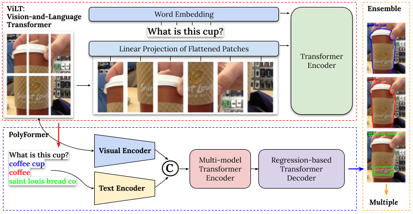

对ViLT模型进行微调之后新得到的权重链接如下：文件：custom_vqa_vilt-b32-finetuned-vqa
链接: https://pan.baidu.com/s/1DOTurjoT2KC4_SByT57o9g?pwd=5vkn 提取码: 5vkn 

You need to download some weights additionally and place them in the correct path locations.

1.Download pretrained [PolyFormer-L](https://drive.google.com/file/d/1lUCv7dUPctEz4vEpPr7aI8A8ZmfYCB8y/view?usp=share_link)

2.文件：bert_cache
链接: https://pan.baidu.com/s/1OcBiC7Ghe0hQt1fc4pXeNA?pwd=ajjb 提取码: ajjb 

3.文件：vilt-b32-finetuned-vqa-main
链接: https://pan.baidu.com/s/1PVYksMUX9W5U-96fmLzYRA?pwd=i9fr 提取码: i9fr 

